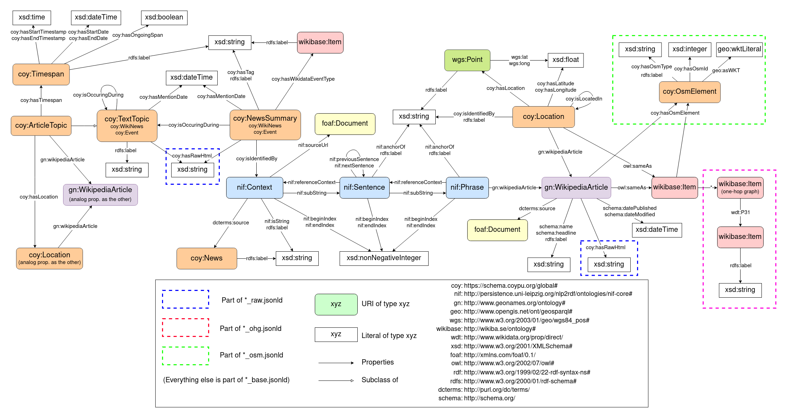

# current-events-to-kg
A parser for the [Wikipedia's Current events Portal](https://en.wikipedia.org/wiki/Portal:Current_events) which generates a knowledge graph from the extracted data. The dataset has a focus on extracting positional and temporal information about the events.

Apart from [Wikipedia's Current events Portal](https://en.wikipedia.org/wiki/Portal:Current_events) these services are used to enrich the dataset with additional data:
- [OpenStreetMaps Nominatim](https://nominatim.openstreetmap.org)
- [Wikidata](https://www.wikidata.org)
- [Falcon 2.0](https://labs.tib.eu/falcon/falcon2/)


## Analytics
While the dataset is generated, some analytics about the extracted data are tracked.
If no `-msd` or `-med` are used, they are saved for every month under `./currenteventstokg/analytics/`.

To view the analytics for a specific month span X to Y, use `-s X -e Y -cca `.

## Usage Examples
All arguments are listed via:
```
python -m currenteventstokg -h
```

Generating a dataset from February 2021 to March 2022:
```
python -m currenteventstokg -s 2/2021 -e 3/2022
```

Generating a dataset for the 2nd of March 2021:
```
python -m currenteventstokg -s 3/2021 -e 3/2021 -msd 2 -med 2
```

## Use a docker container to run it
1. Clone this repo into a location of your choice

2. Navigate to the root directory of your clone.

3. Create the container:
```
docker build -t current-events-to-kg .
```

4. Run it with your arguments, e.g.:
```
./run-container.sh -s 3/2021 -e 3/2021 -msd 2 -med 2
```

## Output
For each parsed month a file for each graph type (base, ohg, osm and raw) gets saved as `{month}_{year}_{graph type}.jsonld`, e.g. `January_2022_base.jsonld`.

If you change `-msd` or `-med`, only a part of each month is parsed. The output of partial month parsing gets saved as `{msd}_{med}_{month}_{year}_{graph type}.jsonld`, e.g. `1_2_January_2022_base.jsonld` When you parse only the first two days.

## Graph types
The generated graphs are subdivided into four graph types: 
- **base**: the main graph
- **ohg**: includes the one hop subgraphs for each Wikidata entity
- **osm**: includes the OSM Nominatim [well-known text](https://en.wikipedia.org/wiki/Well-known_text_representation_of_geometry) for the outlines of locations with its Types and IDs (this graph ca. 10x larger than base)
- **raw**: raw HTML where information was extracted from e.g. the Wikipedia infobox

Because the URIs match in all graph types for each entity, you can just import them in a modular way and it unifies again.


## Schema
The generated knowledge graph has the following schema:



## License
GNU General Public License v3.0 or later

See [COPYING](COPYING) to see the full text.

