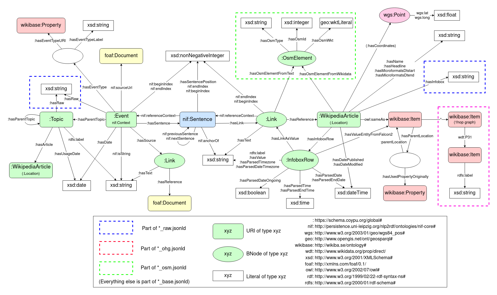

# current-events-to-kg
A parser for the [Wikipedia's Current events Portal](https://en.wikipedia.org/wiki/Portal:Current_events) which generates a knowledge graph from the extracted data. The dataset has a focus on extracting positional and temporal information about the events.

Apart from [Wikipedia's Current events Portal](https://en.wikipedia.org/wiki/Portal:Current_events) these services are used to enrich the dataset with additional data:
- [OpenStreetMaps Nominatim](https://nominatim.openstreetmap.org)
- [Wikidata](https://www.wikidata.org)


## Analytics
While the dataset is generated, some analytics about the extracted data are tracked.
If no `-msd` or `-med` are used, they are saved for every month under `./analytics/`.

To view the analytics for a specific month span X to Y, use `-s X -e Y -cca `.

## Usage Examples
All arguments are listed via:
```
python -m main -h
```

Generating a dataset from February 2021 to March 2022:
```
python -m main -s 2/2021 -e 3/2022
```

Generating a dataset for the 2nd of March 2021:
```
python -m main -s 3/2021 -e 3/2021 -msd 2 -med 2
```

## Use a docker container to run it
1. Clone this repo into a location of your choice

2. Navigate to the root directory of your clone.

3. Create the container:
```
docker build -t current-events-to-kg .
```

4. Run it with your arguments, e.g.:
```
./run-container.sh -s 3/2021 -e 3/2021 -msd 2 -med 2
```

## Schema
The generated knowledge graph has the following schema:



## License
GNU General Public License v3.0 or later

See [COPYING](COPYING) to see the full text.

